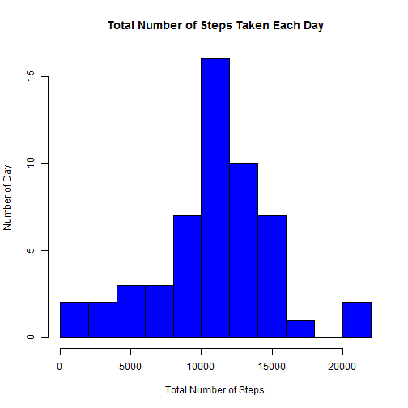
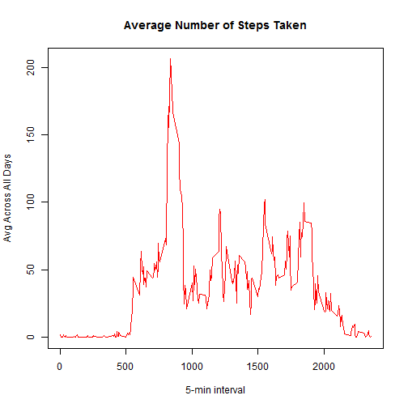
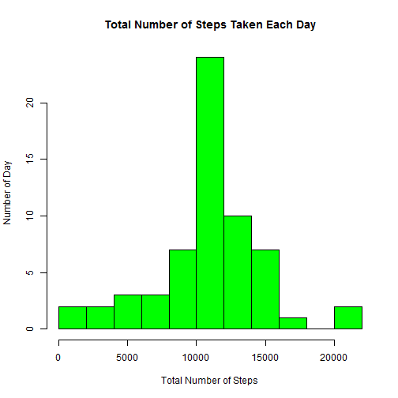
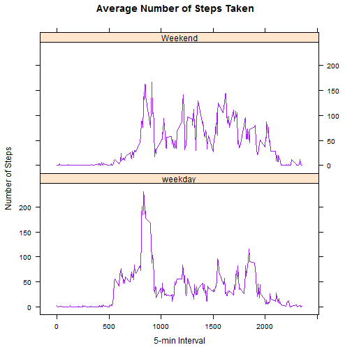

###This is an R Markdown document for Peer Assessment 1 for Module #5 - Reproducible Research.###  

**Loading the data and Omitting rows with NA value in steps**

```r
library(ggplot2)
```

```
## Find out what's changed in ggplot2 with
## news(Version == "1.0.1", package = "ggplot2")
```

```r
library(lattice)
library(knitr)
mydata = na.omit(read.csv("activity.csv"))
```


**Calculating the total number of steps taken per day**

```r
TotalStep <- aggregate(mydata$steps,by=list(mydata$date),sum)
names(TotalStep)[names(TotalStep)=="Group.1"] <- "Date"
names(TotalStep)[names(TotalStep)=="x"] <- "Steps"
print(TotalStep)
```

```
##          Date Steps
## 1  2012-10-02   126
## 2  2012-10-03 11352
## 3  2012-10-04 12116
## 4  2012-10-05 13294
## 5  2012-10-06 15420
## 6  2012-10-07 11015
## 7  2012-10-09 12811
## 8  2012-10-10  9900
## 9  2012-10-11 10304
## 10 2012-10-12 17382
## 11 2012-10-13 12426
## 12 2012-10-14 15098
## 13 2012-10-15 10139
## 14 2012-10-16 15084
## 15 2012-10-17 13452
## 16 2012-10-18 10056
## 17 2012-10-19 11829
## 18 2012-10-20 10395
## 19 2012-10-21  8821
## 20 2012-10-22 13460
## 21 2012-10-23  8918
## 22 2012-10-24  8355
## 23 2012-10-25  2492
## 24 2012-10-26  6778
## 25 2012-10-27 10119
## 26 2012-10-28 11458
## 27 2012-10-29  5018
## 28 2012-10-30  9819
## 29 2012-10-31 15414
## 30 2012-11-02 10600
## 31 2012-11-03 10571
## 32 2012-11-05 10439
## 33 2012-11-06  8334
## 34 2012-11-07 12883
## 35 2012-11-08  3219
## 36 2012-11-11 12608
## 37 2012-11-12 10765
## 38 2012-11-13  7336
## 39 2012-11-15    41
## 40 2012-11-16  5441
## 41 2012-11-17 14339
## 42 2012-11-18 15110
## 43 2012-11-19  8841
## 44 2012-11-20  4472
## 45 2012-11-21 12787
## 46 2012-11-22 20427
## 47 2012-11-23 21194
## 48 2012-11-24 14478
## 49 2012-11-25 11834
## 50 2012-11-26 11162
## 51 2012-11-27 13646
## 52 2012-11-28 10183
## 53 2012-11-29  7047
```


**Creating histogram of the total number of steps taken each day**

```r
hist(TotalStep$Steps,
     main="Total Number of Steps Taken Each Day",
     xlab="Total Number of Steps",
     ylab="Number of Day",
     col="blue",
     breaks=15)
```

 


**Calculating and reporting the mean and median of the total number of steps taken per day**

```r
Meansteps <- mean(TotalStep$Steps)
Mediansteps <- median(TotalStep$Steps)
```
The mean of the total number of steps taken per day (Meansteps) is **10766.19**

```r
Meansteps 
```

```
## [1] 10766.19
```

The median of the total number of steps taken per day (Mediansteps) is **10765**

```r
Mediansteps
```

```
## [1] 10765
```


**Creating time series plot of the 5 minute interval (x-axis) and the average number of steps taken, averaged across all days (y-axis)**

```r
Timeinterval <- aggregate(mydata$steps,by=list(mydata$interval),mean) 
names(Timeinterval)[names(Timeinterval)=="Group.1"] <- "Interval"
names(Timeinterval)[names(Timeinterval)=="x"] <- "Mean"
```


```r
plot(Timeinterval$Interval, Timeinterval$Mean, 
     type='l',
     xlab='5-min interval',
     ylab='Avg Across All Days',
     main='Average Number of Steps Taken',
     col='red')
```

 

**Retreiving the 5-minute interval, on average across all the days in the dataset, which contains the maximum number of steps**

```r
Maxstep <- max(Timeinterval$Mean)
Maxnum <- Timeinterval[which(Timeinterval$Mean == Maxstep),]
```

**835th 5-minute interval** has the maximum number of steps (206.1698)

```r
Maxnum
```

```
##     Interval     Mean
## 104      835 206.1698
```


**Calculating and reporting the total number of missing values in the dataset with NA's**

Loading the data which includes the NA values.
Getting the row count only with NA's

```r
mydataNA = read.csv("activity.csv")
mydataImputedValue = read.csv("activity.csv")
NAset <- subset(mydataNA, is.na(mydataNA$steps))
TotalNArow <- nrow(NAset)
```

The total number of missing values in the dataset with NA's is **2304**

```r
TotalNArow
```

```
## [1] 2304
```

**Filling in all of the missing values in the dataset with the mean for that 5-minute interval**

```r
for (i in 1:nrow(mydataImputedValue))
{
  if (is.na(mydataImputedValue[i,]$steps))
  {
    Intervalvalue <- mydataImputedValue[i,]$interval
    Imputedinterval <- Timeinterval[Timeinterval[, "Interval"] == Intervalvalue,]$Interval
    ImputedMean <- Timeinterval[Timeinterval[, "Interval"] == Intervalvalue,]$Mean
    mydataImputedValue[i,]$steps <- ImputedMean
  }
}
```

**Calculating the total number of steps taken per day and rename column name**

```r
Totalstepimputedvalue <- aggregate(mydataImputedValue$steps,by=list(mydataImputedValue$date),sum) 
names(Totalstepimputedvalue)[names(Totalstepimputedvalue)=="Group.1"] <- "Date"
names(Totalstepimputedvalue)[names(Totalstepimputedvalue)=="x"] <- "Steps"
```

**Creating a new dataset (mydataImputedValue) that is equal to the original dataset but with the missing data filled in**

```r
print(Totalstepimputedvalue)
```

```
##          Date    Steps
## 1  2012-10-01 10766.19
## 2  2012-10-02   126.00
## 3  2012-10-03 11352.00
## 4  2012-10-04 12116.00
## 5  2012-10-05 13294.00
## 6  2012-10-06 15420.00
## 7  2012-10-07 11015.00
## 8  2012-10-08 10766.19
## 9  2012-10-09 12811.00
## 10 2012-10-10  9900.00
## 11 2012-10-11 10304.00
## 12 2012-10-12 17382.00
## 13 2012-10-13 12426.00
## 14 2012-10-14 15098.00
## 15 2012-10-15 10139.00
## 16 2012-10-16 15084.00
## 17 2012-10-17 13452.00
## 18 2012-10-18 10056.00
## 19 2012-10-19 11829.00
## 20 2012-10-20 10395.00
## 21 2012-10-21  8821.00
## 22 2012-10-22 13460.00
## 23 2012-10-23  8918.00
## 24 2012-10-24  8355.00
## 25 2012-10-25  2492.00
## 26 2012-10-26  6778.00
## 27 2012-10-27 10119.00
## 28 2012-10-28 11458.00
## 29 2012-10-29  5018.00
## 30 2012-10-30  9819.00
## 31 2012-10-31 15414.00
## 32 2012-11-01 10766.19
## 33 2012-11-02 10600.00
## 34 2012-11-03 10571.00
## 35 2012-11-04 10766.19
## 36 2012-11-05 10439.00
## 37 2012-11-06  8334.00
## 38 2012-11-07 12883.00
## 39 2012-11-08  3219.00
## 40 2012-11-09 10766.19
## 41 2012-11-10 10766.19
## 42 2012-11-11 12608.00
## 43 2012-11-12 10765.00
## 44 2012-11-13  7336.00
## 45 2012-11-14 10766.19
## 46 2012-11-15    41.00
## 47 2012-11-16  5441.00
## 48 2012-11-17 14339.00
## 49 2012-11-18 15110.00
## 50 2012-11-19  8841.00
## 51 2012-11-20  4472.00
## 52 2012-11-21 12787.00
## 53 2012-11-22 20427.00
## 54 2012-11-23 21194.00
## 55 2012-11-24 14478.00
## 56 2012-11-25 11834.00
## 57 2012-11-26 11162.00
## 58 2012-11-27 13646.00
## 59 2012-11-28 10183.00
## 60 2012-11-29  7047.00
## 61 2012-11-30 10766.19
```

**Creating histogram**

```r
hist(Totalstepimputedvalue$Steps,
     main="Total Number of Steps Taken Each Day",
     xlab="Total Number of Steps",
     ylab="Number of Day",
     col="green",
     breaks=10)
```

 

**Calculating the mean and median total number of steps taken per day**

```r
ImputedValueMeansteps <- mean(Totalstepimputedvalue$Steps)
ImputedValueMediansteps <- median(Totalstepimputedvalue$Steps)
```

After filling in the missing value, the mean of the total number of steps taken per day now is **10766.19**.

```r
ImputedValueMeansteps
```

```
## [1] 10766.19
```
The median of the total number of steps taken per day now is **10766.19**, which is same as mean.

```r
ImputedValueMediansteps
```

```
## [1] 10766.19
```

By comparing with first part of the assignment, we are able to tell that the mean is the same but median is slightly difference. Although the median is slightly difference, but there is minimal impact or nearly no impact of imputing missing data.


**Creating new factor variable in the dataset with two levels - "weekday" and "weekend" indicating whether a given date is a weekday or weekend**

```r
mydataImputedValue$days <- NA
days <- weekdays(as.Date(mydataImputedValue$date))

for (i in 1:nrow(mydataImputedValue))
{
  if(weekdays(as.Date(mydataImputedValue[i,]$date)) == "Saturday")
  {
    mydataImputedValue[i,]$days <- "Weekend"
  }
  else if (weekdays(as.Date(mydataImputedValue[i,]$date)) == "Sunday")
  {
    mydataImputedValue[i,]$days <- "Weekend"
  }
  else
  {
    mydataImputedValue[i,]$days <- "weekday"
  }  
}  
```

**Creating panel plot containing a time series plot of the 5 minute interval (x-axis) and the average number of steps taken, averaged across all weekday days or weekend days (y-axis).**


```r
DayTimeinterval <- aggregate(mydataImputedValue$steps,by=list(mydataImputedValue$interval,mydataImputedValue$day),mean) 

names(DayTimeinterval)[names(DayTimeinterval)=="Group.1"] <- "Interval"
names(DayTimeinterval)[names(DayTimeinterval)=="Group.2"] <- "Day"
names(DayTimeinterval)[names(DayTimeinterval)=="x"] <- "Steps"

xyplot(Steps ~ Interval | Day, 
       data = DayTimeinterval,
     type='l',
     xlab='5-min Interval',
     ylab='Number of Steps',
     main='Average Number of Steps Taken',
     col='purple',
     layout= c(1,2))
```

 
